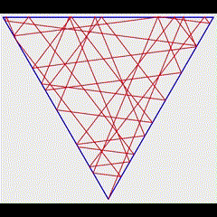
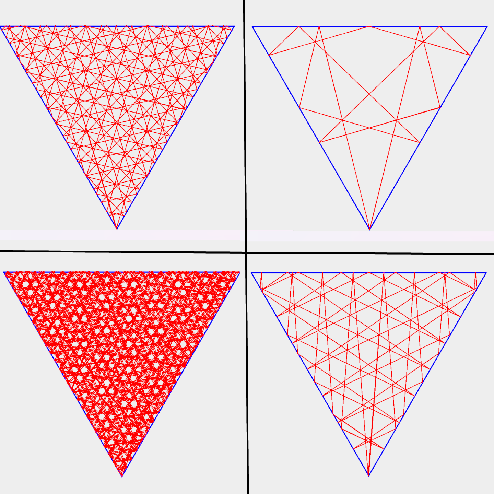
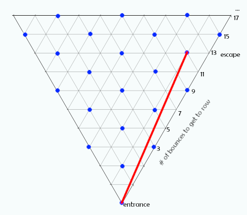
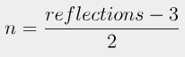
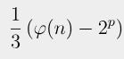

# Project Euler Problem 202 Java Solution

<b>WARNING: SPOILERS FOR THE SOLUTION</b>   I had a lot of fun on this problem and would recommend checking it out before reading this, if you're interested.

  
# The Problem

Formal problem is provided on: <a href="https://projecteuler.net/problem=202">Project Euler Problem 202</a>.

You are trying to find the number of unique angles a laser can be shot through the corner of an equilateral triangle of mirrors, and come back out the hole through which it entered after exactly 12017639147 bounces.

# Files
- Draw202.java
    - Uses JPanel to simulate the problem, created during research/brainstorming 
- Solve202.java
    - Actual implemented solution, solves problem effectively instantly 
- media/
    - Just some pretty pictures of Draw202 and Formulas, not essential 

# Draw202.java

Creates JPanel Simulation of Problem. On the bottom of the panel is a slider which changes the angle at which the laser is shot. On the side of the panel is a slider which determines the number of bounces to simulate (because most of the time the laser never leaves, and you need to stop somewhere).

*Note this simulation was not very helpful (arguably even harmful) towards actually solving the problem, but it was an important part of the solution process, so it is still included.

# Solve202.java

The way to solve the problem is not to think of the laser as bouncing around a single triangle, but rather as one line going through an infinite array of reflected rooms after you do this, you can see that each layer of the graph (after the first) will always result in 2 additional bounces. Also, the number of verteces (n) on a layer can be given by:

Once you see that, you notice that only 1/3 of the verteces on a layer are reflected versions of the vertex through which we entered. Interestingly, the position of these verteces we care about has a sort of "parity" with n mod 3. Each n mod 3 would need a slightly different formula, but because both the problem case and provided test case (1000001 bounces) mod 3 = 2, we just need to implement 1 formula.

This formula is also not just n/3, because some verteces in a row would have already exited the triangle by having hit another vertex eariler, so of the candidate verteces, you only could verteces such that gcd(vertexIndex,n) = 1. This however, can be optimized by using <a href="https://en.wikipedia.org/wiki/Euler%27s_totient_function">Euler's totient function</a> (phi function) (credit to Eigenray on Project Euler for finding this optimization). This yeilds the final formula: 

Where p is the number of prime divisors of n, and phi is Euler's Totient Function.   Solve202 is an implementation of this formula.

